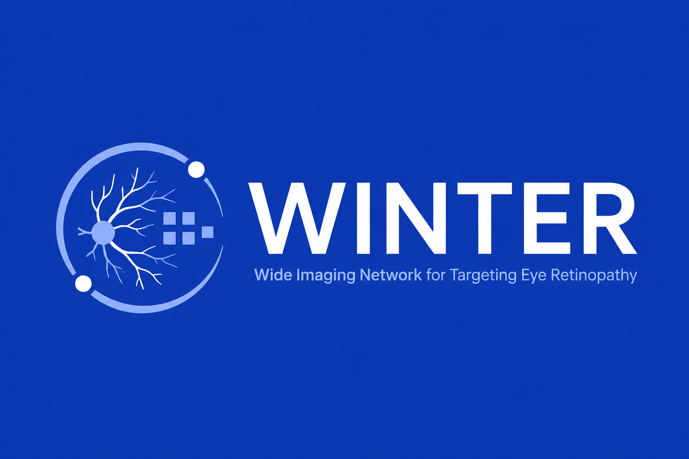

<p align="center">
  
</p>

# WINTER

**W**ide **I**maging **N**etwork for **T**argeting **E**ye **R**etinopathy

안저(망막) 사진을 브라우저에서 바로 분석해, **안과 전문의가 아닌 의료진**이 의료취약지역 진료 현장에서 쓸 수 있게 만든 **임상 판단 보조 도구**입니다.

> [!IMPORTANT]
> **이 도구는 진단 기기가 아닙니다.** 화면에 표시되는 값은 공개 안저 데이터로 학습한 모델의
> 통계적 추정치이며, 확진이 아닙니다. 최종 판단은 반드시 의료진의 임상 소견에 따릅니다.
> 화질이 낮거나 산동이 부족하거나 주변부가 포함되지 않은 영상에서는 신뢰도가 떨어집니다.

---

## 무엇을 하는가

전문의가 상주하지 않는 진료 환경에서, 비전문의가 안저 사진을 보고 **"이 환자를 어느 과로, 얼마나 급하게 보내야 하는가"** 를 판단하도록 돕는 것이 목표입니다. 그래서 출력이 병명 하나가 아니라 다음 세 가지입니다.

1. **의심 소견 목록** — 좌·우 어느 쪽 눈에서든 임계값을 넘은 소견을 전부 나열합니다. 한쪽 눈에만 나타나는 질환이 있고 여러 소견이 동반될 수 있으므로, 1순위만 남기지 않습니다.
2. **권장 협진과 시급도** — 어느 과로, 며칠 안에 보내야 하는지.
3. **의뢰 시 전달할 정보** — 추가 검사 권고, 전신질환 연관 경고, 그리고 환자에게 그대로 읽어줄 수 있는 설명 한 줄.

여기에 **유사 학습 사례 비교**를 붙였습니다. 모델이 낸 추정치 옆에, 학습 데이터 중 임베딩 공간에서 가장 가까운 확정 진단 영상 3장을 눈별로 함께 보여줍니다. 이웃들의 확정 라벨이 모델의 1순위와 몇 개 일치하는지(`이웃 라벨 일치 2/3`)를 표시하므로, 이웃이 엇갈리면 그 자체가 애매한 케이스라는 신호가 됩니다.

### 설계 원칙: 신뢰 최대화가 아니라 신뢰 보정

의료 AI 에서 과신은 자동화 편향으로 이어져 환자 위험이 됩니다. 그래서 UI 가 확신을 연출하지 않도록 의도적으로 제약을 걸었습니다.

- 사진 위 추정치는 **단색**으로 표시하고 위험도를 색으로 말하지 않습니다. 사진 위의 붉은 숫자는 확진처럼 읽힙니다.
- 강조는 **값에 비례한 투명도**로만 줍니다. 순위 기반으로 강·약을 주면 `52%` 와 `44%` 처럼 사실상 동률인 값이 확신 차이로 과장됩니다.
- **"확률" 대신 "유사도"** 를 쓰고, 안전 문구를 화면에서 내리지 않습니다.
- 정상 소견 가능성은 의심 목록의 경쟁자가 아니라 **반대 근거**로 따로 적습니다.

---

## 화면 구성

데스크톱(1920×1080) 단일 화면 EMR 입니다.

<p align="center">
  
</p>

- **1** — 환자명, 나이·성별, 차트번호, 그리고 판단에 필요한 참고 수치만 선별 표시(혈압·HbA1c·기저질환·교정시력 등).
- **2** — 의심 소견 → 권장 협진·시급도 → 추가 검사 권고 → 전신질환 연관 경고 → 환자 설명용 한 줄 → 안전 문구. 하단에 소견 요약 복사·의뢰서 인쇄.
- **3 / 4** — 좌안·우안 안저 사진. 오른쪽 위에 추정 소견 오버레이, 클릭하면 확대 뷰어에서 휠 확대·드래그 이동. 사진은 임상 열람 관례에 맞춰 좌우반전해 표시합니다.
- **5-7 / 8-10** — 각 눈에 대해 학습 데이터에서 가장 가까운 확정 진단 사례 3장. 클릭하면 현재 환자 영상과 나란히 비교합니다.

---

## 기술 스택

| 항목 | 선택 |
| --- | --- |
| 배포 | Vercel Free Tier · 정적 웹 호스팅 (HTML/CSS/JS) |
| 추론 | **클라이언트 사이드** — TensorFlow.js 로 브라우저에서 직접 실행 |
| 서버 | 없음. 안저 영상이 단말을 벗어나지 않습니다. |
| 유사 사례 검색 | 홀드아웃 영상의 임베딩을 빌드 타임에 미리 계산해 배포하고, 브라우저에서는 현재 영상 임베딩 1개만 뽑아 거리 계산 |
| 디자인 시스템 | Nocturne (다크 · 저채도 · accent 는 면이 아니라 선으로) |

서버가 없는 구성을 고른 이유는 배포 비용만이 아닙니다. 영상이 업로드되지 않으므로 환자 영상 전송에 따르는 문제가 애초에 생기지 않습니다.

---

## 저장소 구조

```
WINTER/
├─ frontend/
│  ├─ README.md                      코딩 에이전트용 핸드오프 안내
│  └─ project/
│     ├─ 망막분석 EMR.dc.html          ★ 주 설계 파일 (프로토타입 + 로직)
│     ├─ support.js                   프로토타입 런타임 (x-dc)
│     ├─ _ds/nocturne-…/              디자인 시스템 (styles.css + 가이드)
│     └─ uploads/                     와이어프레임, 데모 이미지
└─ docs/
   ├─ UI_컴포넌트.jpeg                 손그림 와이어프레임 (컴포넌트 1-10)
   ├─ WINTER.png / WINTER 2.png       로고
   └─ 의료진용 …-handoff.zip           원본 핸드오프 번들 (출처 보존용)
```

`망막분석 EMR.dc.html` 은 **프로덕션 코드가 아니라 디자인 프로토타입**입니다. `<sc-for>`, `{{ }}` 바인딩, `DCLogic` 은 `support.js` 전용 문법이므로, 실제 구현은 이 화면의 시각적 출력과 동작을 기준으로 정적 HTML/CSS/JS 로 다시 작성합니다.

### 데모 이미지

프로토타입 화면 확인용 안저 샘플 8장은 데이터셋에서 복사해 쓰는 것이라 저장소에 포함하지 않습니다(`.gitignore`). 로컬에서 화면을 보려면 데이터셋에서 8장을 아래 경로에 넣으면 됩니다.

```
frontend/project/uploads/fundus/
  0_left.jpg   0_right.jpg        ← 3·4번 현재 환자 좌/우안
  1_left.jpg   10_left.jpg   100_left.jpg     ← 5·6·7번 좌안 유사 사례
  1_right.jpg  10_right.jpg  100_right.jpg    ← 8·9·10번 우안 유사 사례
```

경로와 파일명은 `망막분석 EMR.dc.html` 상단의 `DEMO_IMG` 한 곳에만 정의돼 있습니다.

---

## 데이터셋

> [!WARNING]
> **확정 전입니다.** 현재 프로토타입의 화면 문구와 목업 데이터는 `RFMiD` 를 전제로 작성돼
> 있으나, 실제 확보된 데이터셋은 **ODIR-5K** 계열(`N,D,G,C,A,H,M,O` 8클래스)입니다.
> 학습에 쓸 데이터셋을 확정한 뒤, 아래를 화면과 이 문서에 함께 반영해야 합니다.
>
> - 데이터셋 이름과 출처 URL
> - 라이선스와 재배포 조건 (샘플 영상을 저장소에 넣을지 여부가 여기서 갈립니다)
> - 클래스 정의 (`C`=백내장, `M`=근시 를 포함할지 — 현재 화면의 라벨셋은 6개입니다)
> - 홀드아웃 분할 방식

시연에는 학습에 쓰지 않고 떼어 둔 홀드아웃 일부를 사용합니다.

---

## 현재 상태

- [x] 화면 설계 확정 (컴포넌트 1-10, 단일 데스크톱 화면)
- [x] 인터랙션 프로토타입 (확대 뷰어, 유사 사례 비교, 소견 요약 복사)
- [x] 의심 소견 파생 로직 — 양안 합산, 단안·동반 소견 보존
- [x] 이웃 라벨 일치도 표시
- [ ] 데이터셋 확정 및 라이선스 표기
- [ ] 모델 학습 · TensorFlow.js 변환
- [ ] 임베딩 사전 계산 및 유사 사례 검색 연결
- [ ] 정적 HTML/CSS/JS 구현
- [ ] Vercel 배포

---

## 한계

- 안저 사진 한 장으로 판단할 수 없는 질환이 있습니다. 안압·시야검사·OCT 가 필요한 경우 화면이 그렇게 안내합니다.
- 화질이 낮은 영상에서는 추정 신뢰도가 떨어집니다. 이 경우 재촬영이 판단보다 우선입니다.
- 유사도는 모델 임베딩 공간상의 거리이며, **동일 진단을 의미하지 않습니다.**
- 목업 환자 3명(김순자·박정호·이말순)은 시연용 가상 인물이며 실제 환자가 아닙니다.
